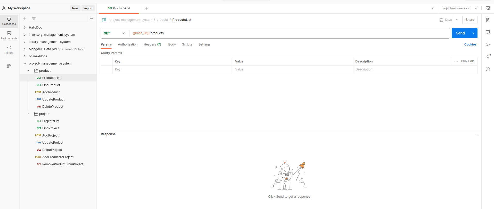

# Project Management System

"A platform for managing various innovative projects, tracking progress, and organizing associated products managed by microservices of product and project."

## Description

This project is a comprehensive management system designed to efficiently handle various projects and associated products through microservices architecture. It enables users to track progress, manage products, and handle project attributes with flexibility. The system provides modules for managing projects, products, and their associations, allowing for advanced tracking and organization.

## Technologies Used

- Typescript
- Javascript
- NodeJs
- MySQL
- Sequelize

## Badges

## Visuals

`Screenshots of postman collection for getting visual interpretation of the API's which you can integrate in your front-end.`

- 

## Installation

To install and run the project locally, follow these steps:

1. Clone the repository:

   `Currenly no repository`

2. Install dependencies for individual microservices:
   `npm install:product` & `npm install:project`

3. Install dependencies for all microservices:
   `npm install:all`
4. Set up environment variables (if required ) for individual microservices.

5. Lint the code and solve linting errors:
   `npm run lint` & `npm run lint:fix`

6. Run migrations and Undo migrations:
   `npm run migrate` & `npm run migrate:undo`

7. Seed the database and Undo seed:
   `npm run seed` & `npm run seed:undo`
8. Build the project:
   `npm run build`

9. Start the microservices:

   \*With nodemon
   `npm run start:all`

   \*With nodemon for individual microservice
   `npm run start:product` & `npm run start:project`

## Usage

- Project Module:

  - Browsing and getting list of products.
  - Managing project (add, update, delete - soft and hard).
  - Adding and removing products from project

- Product Module:

  - Browsing and getting list of products.
  - Managing products (add, update, delete - soft and hard).

## Support

- Upcoming features and improvements:

  - Integration with external project management systems.
  - Advanced analytics and reporting.

## Contributing

- We welcome contributions! Please follow these guidelines:

  - Fork the repository and create your branch from main.
  - Ensure your code follows our coding standards.
  - Submit a pull request detailing your changes.

## Authors and acknowledgment

- Ataa Vohra - Lead Developer

## License

- This project is licensed under the ISC License. See the LICENSE file for details.

## Project status

`Development is ongoing with regular updates and improvements.`
